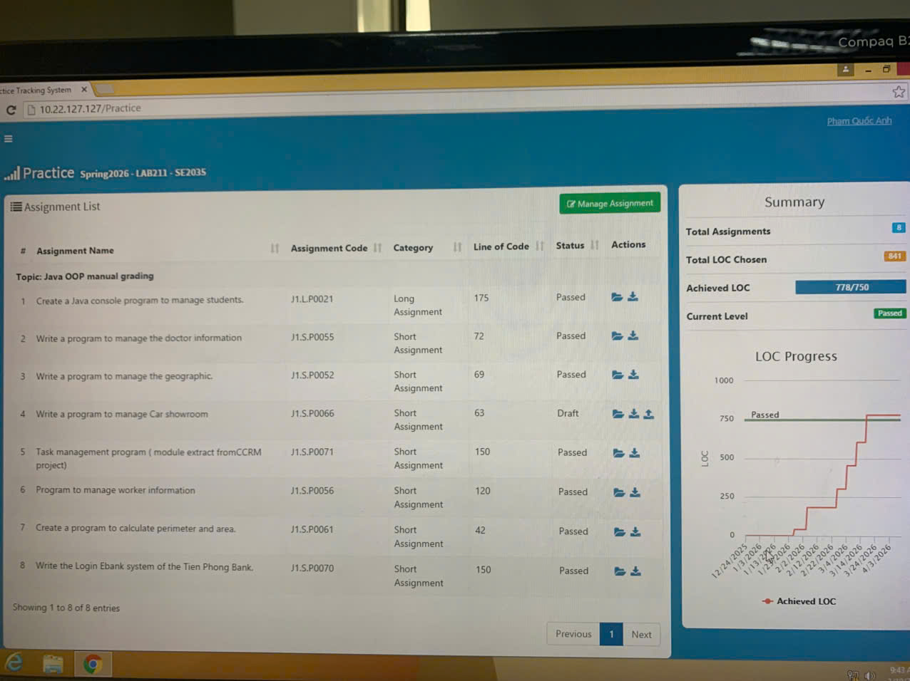

<h1 align="center">🚀 LAB211 - AnNV22</h1>

  
  
  

---

## 📌 Notes from experience

> Học thầy AnNV22 thì cố gắng mà pass bằng được. Thầy tuyệt vời, chăm hỏi thầy và nghe lời là dễ qua thôi!  
> Thầy sẽ có cái form riêng để code theo. Trong quá trình học có gì không rõ thì chăm hỏi thầy vào là được.  
> Code của thầy cần kỹ, đủ theo yêu cầu checklist mới được review và chăm đi code ngoài là một điểm cộng.  
> Phải thật là kiên trì và chịu khó nhé!  
>  
> 💪 **Chúc các bạn may mắn!!!**

---

## 🧠 Concepts Covered

  
  
  
  
  

---

## 📊 Progress

| 🚀 Exercise | 📘 Description | 🔢 LOCS |
|------------|--------------|--------|
| [J1.S.P0061](https://github.com/adonisquocanhSE/AnNV22LAB211/tree/main/Shape) | Shape | 42 |
| [J1.S.P0052](https://github.com/adonisquocanhSE/AnNV22LAB211/tree/main/Country) | Country | 69 |
| [J1.S.P0055](https://github.com/adonisquocanhSE/AnNV22LAB211/tree/main/DoctorManagement) | Doctor Management | 73 |
| [J1.S.P0056](https://github.com/adonisquocanhSE/AnNV22LAB211/tree/main/WorkerManagement) | Worker Management | 120 |
| [J1.S.P0071](https://github.com/adonisquocanhSE/AnNV22LAB211/tree/main/TaskManagement) | Task Management | 150 |
| [J1.S.P0070](https://github.com/adonisquocanhSE/AnNV22LAB211/tree/main/EbankLoginSystem) | Ebank Login System | 150 |
| [J1.S.P0021](https://github.com/adonisquocanhSE/AnNV22LAB211/tree/main/StudentManagement) | Student Management | 175 |

---

## 📈 Overall Progress

  

  [███████░░░] 70%

---

## 📉 LOC Progress

  

---
